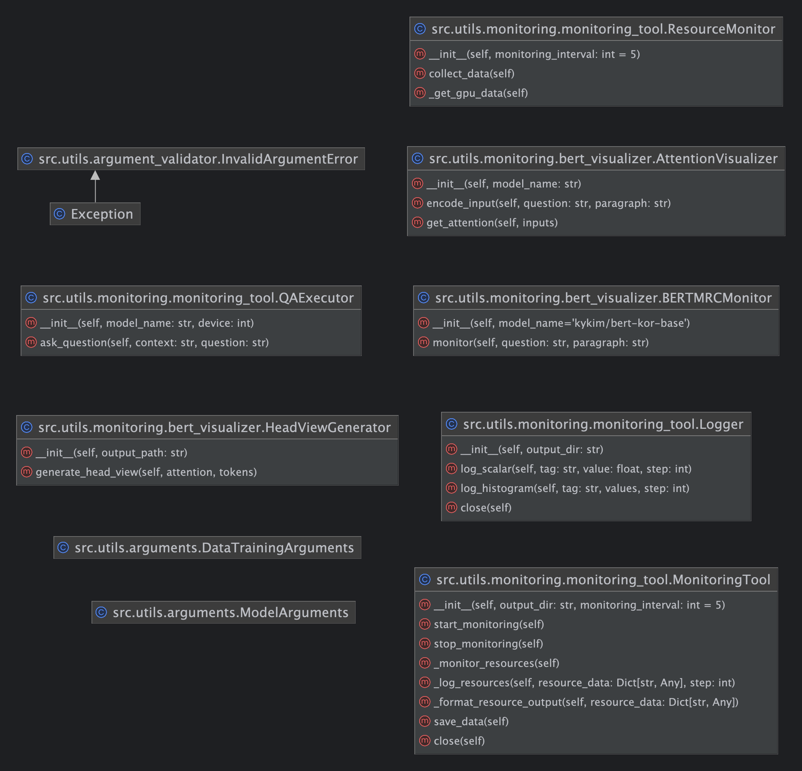
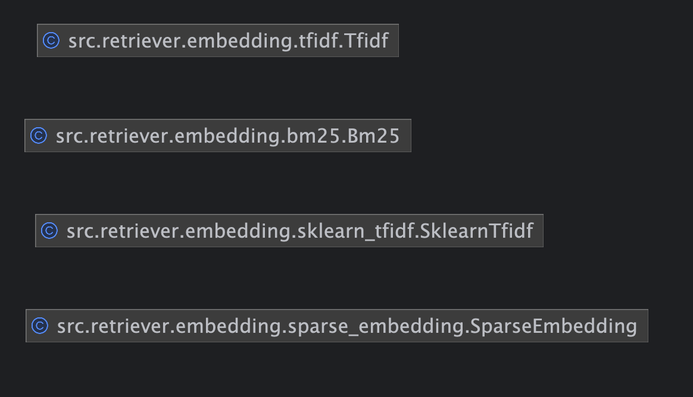

# Open-Domain Question Answering(ODQA)

## 📕프로젝트 개요

* 부스트캠프 AI Tech `NLP` 트랙에서 개체된 level 2 대회
* `Linking MRC and Retrieval: Open-domain Question Answering(ODQA)` Task.
  * ODQA: 지문이 따로 주어지지 않은 채로 방대한 World Knowledge에 기반하여 질의응답
  * 질문에 관련된 문서를 찾는 `retriever`와 문서를 읽고 적절한 답변을 찾거나 만드는 `reader`의 `two-stage`로 구성.
* 학습 데이터셋은 3,952개, 검증 데이터는 240개, 테스트 데이터는 600개로 테스트 데이터 중 40%만 Public으로 반영 대회 종료 후 Private 점수가 공개됨.
  * `id` : 질문의 고유 id
  * `question` : 질문
  * `answers` : 답변에 대한 정보, 하나의 질문에 하나의 답변만 존재.
    * `answer_start` : 답변의 시작 위치
    * `text` : 답변의 텍스트
  * `context` : 답변이 포함된 문서
  * `title` : 문서의 제목
  * `document_id` : 문서의 고유 id

* `Exact Match`, `F1 Score`를 통한 평가.

## 📆세부일정

* 프로젝트 기간(4주) : 09.30(월) ~ 10.24(목)

## 😁팀소개

<table style="width: 100%; text-align: center;">
  <tr>
    <th>강감찬</th>
    <th>이채호</th>
    <th>오승범</th>
    <th>이서현</th>
    <th>유채은</th>
    <th>서재덕</th>
  </tr>
  <tr>
    <td style="text-align: center; vertical-align: middle;"></td>
    <td style="text-align: center; vertical-align: middle;"></td>
    <td style="text-align: center; vertical-align: middle;"></td>
    <td style="text-align: center; vertical-align: middle;"></td>
    <td style="text-align: center; vertical-align: middle;"></td>
    <td style="text-align: center; vertical-align: middle;"></td>
  </tr>
  <tr>
    <td><a href="https://github.com/gsgh3016">@감찬</a></td>
    <td><a href="https://github.com/chell9999">@채호</a></td>
    <td><a href="https://github.com/Sbeom12">@승범</a></td>
    <td><a href="https://github.com/seohyeon0677">@서현</a></td>
    <td><a href="https://github.com/canolayoo78">@채은</a></td>
    <td><a href="https://github.com/jduck301">@재덕</a></td>
  </tr>
  <tr>
    <td>고독한 음악인 감찬</td>
    <td>혼자있는 지방러 채호</td>
    <td>살을 빼야하는 승범</td>
    <td>귀염둥이 막내 서현</td>
    <td>야구를 볼 수 있는 채은</td>
    <td>오리는 꽥꽥 재덕</td>
  </tr>
   <tr>
    <td>Project Manager, 통합 관리 모듈, 리더의 리더</td>
    <td>EDA, 데이터 분화, 기타 실험, 데이터 전처리</td>
    <td>Sparse 임베딩 구현, 기술 지원,</td>
    <td>모니터링 툴, 테스트 코드, 모델 결합 및 실험</td>
    <td>팀 리더, retriever 팀장, Dense 임베딩 구현, Data 정제</td>
    <td>데이터 전/후처리, 모델 결합 및 실험</td>
  </tr>
</table>

## 프로젝트 수행 절차 및 방법

본 프로젝트는 ODQA 시스템의 개발을 목표로 하여, Retrieval과 Reader 모델로 구성된 시스템을 단계별로 설계하고 개발하였습니다. 각 팀원은 Dense/Sparse Embedding 및 데이터 정제, 전처리, 평가 지표 설계, 소프트웨어 아키텍처 설계 등 프로젝트 전반에 걸친 각 요소를 체계적으로 나누어 담당하였으며, 다음과 같은 절차로 프로젝트를 진행하였습니다.

### 1. 목표 설정 및 계획 수립

프로젝트 초기에 팀원들이 부스트캠프 참가 동기와 각자의 학습 목표를 공유하였습니다. 이 공유된 내용을 바탕으로 팀 단위 목표를 설정하였고, 리더보드 순위보다는 ODQA 시스템의 깊은 이해를 중점으로 두었습니다. 이후, SMART 목표 설정 방식을 도입하여 구체적이고 실현 가능한 목표를 수립하였습니다.

이를 바탕으로 전체 프로젝트는 Retrieval과 Reader로 구분하여 팀을 구성하였고, 각 팀은 독립적으로 최적화된 결과를 내는 것을 목표로 실험과 개발을 진행하였습니다.

### 2. 데이터셋 EDA 및 전처리

#### 2.1 데이터셋 분석

프로젝트 시작 단계에서 MRC(Machine Reading Comprehension) 형태의 데이터셋에 대한 EDA를 수행하여 데이터의 구조와 특성을 분석하였습니다. 이를 통해 데이터셋의 주요 구성 요소인 질문, 정답, 문맥의 연관성을 파악하고, 데이터 정제 및 전처리 필요성을 도출하였습니다.

#### 2.2 데이터 정제 및 전처리

데이터 정제 과정에서는 불필요한 데이터를 제거하고, 모델이 학습하기 적합한 형식으로 데이터셋을 변환하였습니다. 예를 들어, 질문에 한글, 영어, 숫자가 혼합된 경우를 분석하여 한글이 전혀 포함되지 않은 문서를 제거하거나 특수 문자와 코드로 추정되는 데이터 등을 필터링하였습니다.

또한, KorQuAD와 같은 추가 데이터셋을 활용하여 데이터 증강을 수행하였으며, 질문에 명사를 추가하는 등 다양한 전처리 방법을 적용하였습니다. 이러한 과정은 모델의 성능 개선과 데이터의 품질 향상에 중요한 역할을 하였습니다.

### 3. 모델 설계 및 구현

#### 3.1 Retriever 설계

Retriever 모델의 설계는 Sparse와 Dense Embedding 방식을 모두 고려하였습니다. Sparse Embedding에서는 TF-IDF와 BM25를 실험하였고, 다양한 파라미터 설정과 토크나이저 실험을 통해 성능 최적화를 도모하였습니다. BM25의 성능이 우수하다는 결과를 바탕으로 max_feature, n-gram, BM25의 k1과 b 파라미터 등을 조정하며 최적의 조합을 찾았습니다.

Dense Embedding에서는 BERT 기반의 multilingual 모델과 한국어 전용 모델을 활용하였고, 단순히 Dense Embedding만으로는 성능이 높지 않다는 점을 인식하여, Sparse 모델의 상위 검색 결과를 Dense 모델이 재배치하는 방법을 실험하였습니다. 그러나 최종적으로는 Sparse Embedding 단일 사용이 더 나은 성능을 보여 이를 최종 선택하였습니다.

#### 3.2 Reader 설계 및 리팩토링

Reader 모델은 다양한 pre-trained 모델을 실험하여 최적의 모델을 선택하였습니다. 이 과정에서 기존 베이스라인 코드의 구조적 문제점을 해결하기 위해 객체지향 설계를 도입하여 코드의 유지보수성과 확장성을 개선하였습니다.

Reader 클래스는 학습, 평가, 예측 등의 역할을 분리하여 모듈화하였고, 전/후처리 모듈과 데이터 처리의 일관성을 위해 `DataHandler`와 `DataProcessor` 클래스를 설계하였습니다. 이를 통해 데이터의 변형과 처리가 보다 쉽게 이루어질 수 있도록 하였습니다.

### 4. 모델 성능 실험 및 평가

#### 4.1 Sparse/Dense Embedding 실험

각 Embedding 방식에 대해 다양한 파라미터와 토크나이저 실험을 수행하였습니다. 예를 들어, BM25의 max_feature와 n-gram 조합, Dense 모델의 negative sampling 비율 및 epoch 설정 등을 실험하였으며, 실험 결과를 체계적으로 기록하여 각 설정의 성능을 분석하였습니다.

#### 4.2 평가 지표 설계

Sparse 및 Dense 모델의 성능을 효과적으로 비교할 수 있도록 Retrieval 성능 평가를 위한 다양한 지표를 도입하였습니다. Exact Match(EM), F1 Score 외에도 `Context in Retriever`, `Reverse Ranking`, `Linear Ranking` 등을 활용하여 문서 검색 단계에서의 성능을 평가하였습니다. 이를 통해 모델이 올바른 문맥을 얼마나 잘 추출할 수 있는지 파악할 수 있었습니다.

### 5. 소프트웨어 아키텍처 설계 및 구현

#### 5.1 객체 지향 설계

프로젝트의 핵심 코드들은 객체 지향 설계를 통해 구조화하였습니다. 모델의 모듈화를 통해 다양한 기능의 독립성과 재사용성을 확보하였으며, 각각의 클래스가 하나의 책임을 갖도록 설계하여 유지보수가 쉽고 확장 가능한 시스템을 구축하였습니다.

Reader 클래스는 다양한 데이터 전처리 및 학습 모듈을 활용할 수 있도록 재설계되었고, 이를 통해 새로운 기능 추가 및 실험이 용이해졌습니다.

### 6. LLM 및 데이터 증강 실험

데이터 증강을 위해 KorQuAD와 같은 외부 데이터셋을 활용하였고, LLM을 활용하여 질문 생성 및 데이터 이상치 처리 등의 실험을 수행하였습니다. 실험 과정에서 질문 생성의 품질이 성능에 미치는 영향을 확인하였으며, 추후 개선을 위한 다양한 접근 방안을 도출하였습니다.

### 7. 협업 및 코드 관리

#### 7.1 팀 분업 및 협업 도구 활용

팀은 Retrieval과 Reader로 나누어 각 팀의 역할을 명확히 하였고, GitHub를 적극적으로 활용하여 협업하였습니다. GitHub flow 방식을 채택하여 각자의 작업 내용을 기능 단위로 분리하고 코드 리뷰를 통해 품질을 관리하였습니다.

#### 7.2 프로젝트 회고 및 개선 방안

프로젝트 후반부에 진행된 회고를 통해 각 팀원은 자신이 맡았던 부분에 대한 성과와 개선 방안을 공유하였으며, 향후 프로젝트에서 적용할 수 있는 방법론과 효율적인 협업 방안을 도출하였습니다.

### 8. 최종 성능 결과 및 평가

최종 리더보드에서 EM 및 F1 점수 기준으로 모델의 성능을 평가하였으며, Sparse Embedding을 활용한 Retrieval 단계가 최종적으로 높은 성능을 보였습니다. 또한, 팀의 협업 경험과 코드 리팩토링을 통해 얻은 성과들을 바탕으로 프로젝트 전반에 걸친 성과를 분석하고, 향후 개선할 부분을 도출하였습니다.

## 프로젝트 아키텍쳐
* 소프트웨어 아키텍처
  * Reader
    
  * Utils
    
  * Retriever
    

## 프로젝트 결과
||Public|Private|
|:-:|:-:|:-:|
|EM|45.4200%|58.3500%|
|F1|46.3900%|56.9700%|
|최종 등수|16등|16등|

## Getting Started

# Appendix

## A. 주요 기술 스택 및 도구

본 프로젝트에서 사용된 주요 기술과 도구는 다음과 같습니다.

### A.1 개발 환경 및 라이브러리

- **Python**: 프로젝트의 주요 프로그래밍 언어로, 데이터 처리 및 모델 구현에 활용.
- **Hugging Face Transformers**: 다양한 NLP 모델의 학습 및 추론을 위한 프레임워크. Reader 모델 구현에 사용.
- **Scikit-learn**: Sparse Embedding 및 데이터 전처리 실험에서 사용된 파이썬 머신러닝 라이브러리.
- **PyTorch**: Dense Embedding 모델의 학습 및 튜닝을 위한 주요 딥러닝 프레임워크.
- **LangChain & Ollama**: LLM을 활용한 데이터 이상치 탐지 및 질문 생성 실험에 사용.
- **Jupyter Notebook**: EDA, 데이터 분석, 실험 결과 시각화에 활용.

### A.2 협업 및 프로젝트 관리 도구

- **GitHub**: 코드 버전 관리 및 협업. GitHub Flow를 통해 기능 단위로 브랜치를 관리하고, 코드 리뷰를 진행.
- **JIRA**: 프로젝트 관리 및 작업 할당. 각 팀원의 작업 현황과 이슈를 트래킹하며, Sprint 계획을 수립.
- **Notion**: 팀 회의록, 실험 결과 기록, 프로젝트 진행 상황 문서화에 사용.
- **Slack & Zoom**: 팀원 간의 원활한 커뮤니케이션 및 화상 회의 도구.

## B. 실험 환경 및 하드웨어

### B.1 컴퓨팅 자원

- **GPU (NVIDIA V100)**: Dense Embedding 모델 학습 및 Reader 모델 튜닝을 위해 사용.
- **V100 서버**: 주로 훈련과 대규모 실험을 수행하며, 제한된 자원 내에서 효율적인 자원 활용을 위한 배치 실험 진행.

### B.2 소프트웨어 환경

- **Python 3.8**: 모든 코드 구현의 기본 환경.
- **PyTorch 1.10**: Dense Embedding과 Reader 모델 구현에 사용.
- **CUDA 11.4**: GPU 가속을 위한 딥러닝 프레임워크 설정.
- **Hugging Face Datasets & Tokenizers**: 데이터 로드 및 전처리, 토크나이징 도구.

## C. 프로젝트 구조

프로젝트의 디렉토리 구조는 다음과 같이 설계되었습니다.

├── notebook
│   ├── Data_preprocessing.ipynb
│   ├── EDA_with_LLM.ipynb
│   ├── autoEDA.txt
│   ├── dataeda.ipynb
│   ├── requirements.txt
│   ├── single_stage_ODQA.ipynb
│   └── test.ipynb
├── src
│   ├── config
│   │   ├── key_names.py
│   │   ├── path_config.py
│   │   └── reader_configuration.py
│   ├── main.py
│   ├── reader
│   │   │   ├── data_processor.cpython-311.pyc
│   │   │   ├── evaluation.cpython-311.pyc
│   │   │   ├── model.cpython-311.pyc
│   │   │   └── trainer_qa.cpython-311.pyc
│   │   ├── add_nouns.py
│   │   ├── aug_korquad.py
│   │   ├── data_controller
│   │   │   ├── data_handler.py
│   │   │   ├── data_processor.py
│   │   │   └── postprocess_qa.py
│   │   ├── generate_q.py
│   │   └── model
│   │       ├── huggingface_manager.py
│   │       ├── reader.py
│   │       ├── result_saver.py
│   │       ├── trainer_manager.py
│   │       └── trainer_qa.py
│   ├── retriever
│   │   ├── embedding
│   │   │   ├── bm25.py
│   │   │   ├── sklearn_tfidf.py
│   │   │   ├── sparse_embedding.py
│   │   │   └── tfidf.py
│   │   ├── retrieval
│   │   │   ├── dense_retrieval.py
│   │   │   └── sparse_retrieval.py
│   │   ├── retriever.py
│   │   ├── score
│   │   │   ├── ranking.py
│   │   │   └── rerank.py
│   │   └── similarity
│   │       └── similarity.py
│   └── utils
│       ├── argument_validator.py
│       ├── arguments.py
│       ├── context_into_articles.py
│       ├── context_into_sentences.py
│       ├── log
│       │   └── logger.py
│       ├── monitoring
│       │   ├── bert_visualizer.py
│       │   └── monitoring_tool.py
│       ├── seed.py
│       ├── timer.py
│       ├── tokenizer_checker.py
│       └── tokenizer_validator.py
└── test
    │   ├── conftest.cpython-311-pytest-8.3.3.pyc
    │   ├── test_model.cpython-311-pytest-8.3.3.pyc
    │   └── test_reader.cpython-311-pytest-8.3.3.pyc
    ├── conftest.py
    ├── test_data_handler.py
    ├── test_data_postprocessor.py
    ├── test_data_preprocessor.py
    └── test_model.py

## D. 실험 결과 데이터

### D.1 Retrieval 성능 실험 결과

다양한 Sparse 및 Dense Embedding 기법의 성능 비교 실험 결과는 아래와 같습니다.

| Model                  | Top-K | context_in_retriever | Reverse Rank | Linear Score |
|------------------------|-------|----------------------|--------------|--------------|
| BM25 (max_feature=200K) | 10    | 0.82490              | 0.47262      | 0.74090      |
| TF-IDF (max_feature=100K) | 5    | 0.67055              | 0.33891      | 0.57221      |
| Dense Embedding (BERT) | 10    | 0.19680              | -            | -            |

위 표는 주요 실험 결과의 요약본이며, 각 실험의 파라미터 설정과 결과는 데이터 구조를 통해 체계적으로 관리하였습니다. 이를 통해 Sparse Embedding의 우수한 성능을 바탕으로 최종 모델에 BM25 기반의 Retrieval 시스템을 채택하였습니다.

### D.2 Reader 성능 실험 결과

Reader 모델의 성능은 여러 pre-trained 모델과의 비교를 통해 최적의 모델을 선정하였습니다.

| Pre-trained Model                 | EM Score | F1 Score |
|-----------------------------------|----------|----------|
| klue/roberta-base                 | 62.5     | 71.1069  |
| monologg/koelectra-base-v3        | 61.25    | 69.2452  |
| microsoft/deberta-v3-base         | 46.25    | 54.1471  |
| klue/bert-base                    | 53.75    | 62.3042  |

최종적으로 `klue/roberta-base` 모델이 최적의 성능을 보여주었으며, 이를 기반으로 추가적인 하이퍼파라미터 튜닝을 진행하였습니다.

## E. 추가 참고 문헌 및 자료

- **BM25 알고리즘**: Stephen E. Robertson, Karen Sparck Jones, "Relevance weighting of search terms," Journal of the American Society for Information Science, 1976.
- **Dense Passage Retrieval**: Vladimir Karpukhin et al., "Dense Passage Retrieval for Open-Domain Question Answering," arXiv, 2020.
- **BERT**: Jacob Devlin et al., "BERT: Pre-training of Deep Bidirectional Transformers for Language Understanding," arXiv, 2019.
- **Hugging Face Documentation**: [Hugging Face Docs](https://huggingface.co/docs/)
- **LangChain**: [LangChain Official Website](https://www.langchain.com/)

---

본 Appendix는 프로젝트의 전반적인 구성, 실험 환경, 기술 스택, 그리고 데이터 관리 방식을 이해하는 데 도움을 주기 위해 작성되었습니다. 각 요소는 실험의 재현 가능성을 높이고, 향후 프로젝트에서 참조할 수 있도록 체계적으로 기록하였습니다.
